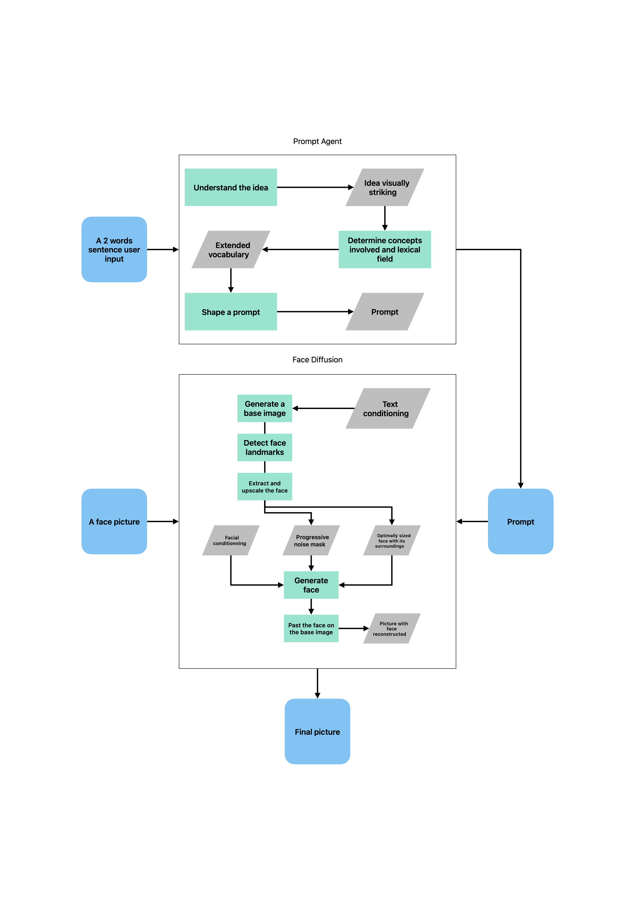

# Narcis.ai: Production AI Portrait Generation
## Infrastructure Expert → ML Systems Engineering

**Live System**: [narcis.ai](https://narcis.ai) | **Technical Documentation**: Demonstrating the natural progression from infrastructure to ML systems

*Production face identity transformation: Byzantine emperor artistic interpretation generated by the narcis.ai system*

This technical documentation showcases how infrastructure engineering expertise—distributed systems, container orchestration, cost optimization—provides the ideal foundation for building production ML systems. Through a real AI portrait generation system serving users in production, the writeup demonstrates that infrastructure and machine learning are unified disciplines requiring the same foundational knowledge in reliability, scalability, and operational practices.

## Technical Journey: Three Deep Dives

**[Page 1: Container Orchestration & Service Mesh Architecture](README#page-1-container-orchestration--service-mesh-architecture)**  
*Infrastructure foundations* - ECS cluster orchestration, multi-tier GPU capacity providers, service mesh networking, and AWS resource management patterns that provide the reliability foundation for production ML workloads.

**[Page 2: ML Pipeline Engineering Deep Dive](README#page-2-ml-pipeline-engineering-deep-dive)**  
*Advanced technical implementation* - Custom diffusion implementations, differential timestep scheduling, PhotoMaker identity preservation, and sophisticated tensor operations that go beyond standard framework usage.

**[Page 3: Production Operations & Web Platform](README#page-3-production-operations--web-platform)**  
*Real-world deployment* - Discord bot command interfaces, Remix React web platform, PostgreSQL session management, and unified caching systems that power the live user-facing application.

---

**Supporting Materials**: [Technical code examples and diagrams](technical-materials)

## Production System Highlights

**Infrastructure Engineering** (Page 1)
- **Container Orchestration**: ECS Service Connect with 198 Terraform resources managing multi-tier GPU capacity
- **Cost Optimization**: 70%+ savings through intelligent spot instance strategies (G6→G5→G4dn failover)
- **Development Velocity**: 2-3 minute deployment cycles from local development to production GPU environments

**ML Pipeline Engineering** (Page 2)  
- **Custom Diffusion**: SDXL + PhotoMaker V2 integration with differential timestep scheduling
- **Identity Preservation**: Multi-million parameter face identity injection through progressive masking
- **Advanced Tensor Operations**: Sophisticated batch processing and CFG optimization beyond standard frameworks

**Production Operations** (Page 3)
- **Live User System**: Publicly available at [narcis.ai](https://narcis.ai) serving artistic transformations
- **Discord Operations Interface**: Real-time ML workflow control with parameter tuning and batch generation
- **Generation Performance**: ~20 seconds on G6/G5 instances, ~40 seconds on G4dn spot instances
- **Remix Web Platform**: PostgreSQL session management and unified caching for instant image loading

## Two-Stage Generation Pipeline

*Complete generation pipeline: From 2-word user input to final artistic portrait via prompt agent and face diffusion*

Novel approach: **Complete separation of artistic composition from face identity** for interpretable, debuggable AI:
- **Stage 1**: Pure SDXL text-driven generation without face conditioning
- **Stage 2**: Differential diffusion with progressive masking for identity injection

## Live Production Web Interface

*Multi-column infinite scroll portrait gallery showing AI-generated artistic transformations with real-time updates*

The production system at [narcis.ai](https://narcis.ai) demonstrates the complete infrastructure → ML → operations pipeline working with real users. The system shows how infrastructure engineering principles—reliability, observability, cost optimization—directly enable production ML systems that are interpretable, steerable, and operationally manageable.

**[→ Read the complete technical writeup](README)** to see how distributed systems expertise naturally extends to building sophisticated, production-ready AI systems.
